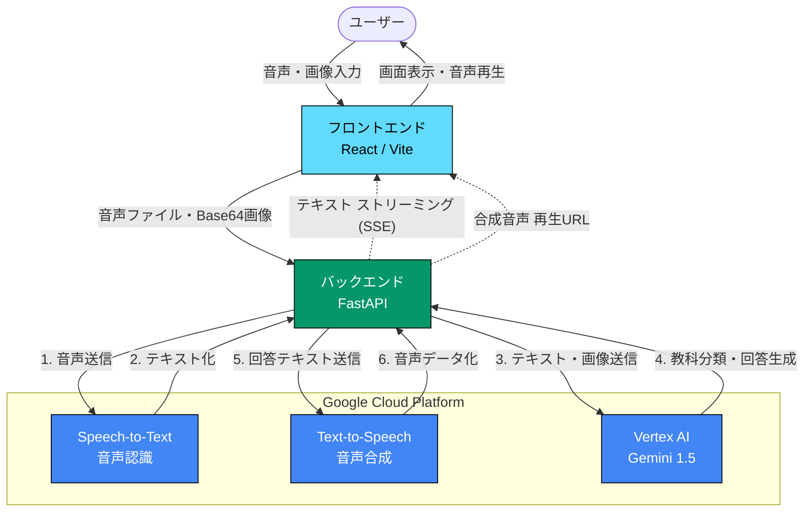

# Tutor-AI（家庭教師AIシステム）

Tutor-AIは、音声および画像（カメラ映像）を組み合わせたマルチモーダルな質問応答システム（家庭教師AI）です。
ユーザーはマイクによる音声、またはカメラで撮影した問題やノートの画像とともに音声を送信することで質問を行います。システムは質問内容を適切な教科に自動分類した上で、AI講師のトーンで正確な回答を生成・読み上げます。

本システムは、中学受験（小学3〜6年生）および高校受験（中学1〜3年生）の両方に対応しています。

## 主な機能
*   **マルチモーダル入力**: マイク録音とWebカメラでの画像撮影（複数枚可）を組み合わせた質問。
*   **受験種別の切り替え**:
    *   **中学受験モード**: 国語、算数、理科、社会に対応。
    *   **高校受験モード**: 国語、数学、理科、社会、英語に対応。
    *   モードごとに過去のチャット履歴（データベース）が完全に物理分離されます。
*   **AIによる自動分類・見出し生成**: 質問内容を解析し、自動的に適切な教科に分類。短い見出しも自動生成します。
*   **Google検索グラウンディング (Search Grounding)**: 最新のウェブ情報を参照し、ハルシネーションを防ぎます。
*   **音声合成 (TTS) と再生制御**: 回答テキストを自動的に読み上げます。次の質問に移りたい時は即座に停止可能です。

---

## システム構成・アーキテクチャ

システムはバックエンド（FastAPI）とフロントエンド（React / TypeScript / Vite）の構成となっています。



### 動作環境・主要技術
*   **フロントエンド**: React, TypeScript, Vite, Tailwind CSS, Lucide React, react-webcam
*   **バックエンド**: FastAPI, Python 3.10以上, SQLAlchemy, SQLite
*   **使用外部API**: Google GenAI SDK (Vertex AI), Google Cloud Speech-to-Text API, Google Cloud Text-to-Speech API

---

## データベース設計

データベースには SQLite を使用し、SQLAlchemy でモデルを定義しています。受験種別に応じて2つのDBファイル (`chat_history_junior_high.db`, `chat_history_high_school.db`) に物理分離されます。

### `sessions` テーブル
セッション（会話スレッド）を管理するテーブル。
| カラム名 | 型 | 説明 |
| :--- | :--- | :--- |
| `id` | String | セッションID (UUID) |
| `category` | String | 教科カテゴリ（国語、算数/数学、理科、社会、英語、その他） |
| `title` | String | ルーターAIによって自動生成された短いタイトル |
| `exam_type` | String | 受験タイプ（`junior-high` または `high-school`） |
| `grade` | String | 対象学年（小3〜小6、中1〜中3） |
| `created_at` | DateTime | セッション作成日時 |

### `messages` テーブル
やり取りされたメッセージ（ログ）を管理するテーブル。
| カラム名 | 型 | 説明 |
| :--- | :--- | :--- |
| `id` | String | メッセージID (UUID) |
| `session_id` | String | 外部キー (`sessions.id`) |
| `role` | String | 発話者（`user` または `model`） |
| `text_content` | Text | 発話内容テキスト |
| `audio_file_path` | String | 生成/保存された音声ファイル名（ユーザー: webm / AI: mp3） |
| `image_file_path` | String | ユーザーが送信した画像ファイル名（複数時はカンマ区切り） |
| `created_at` | DateTime | メッセージ作成日時 |


## APIエンドポイント

*   **`POST /api/chat`**
    *   ユーザーからの質問（音声および複数画像）を受信し、判定・回答生成・音声合成までを処理してServer-Sent Events (SSE) でストリーミング配信します。
*   **`GET /api/sessions`**
    *   指定された受験種別の全セッションを新着順で取得します。
*   **`GET /api/sessions/{session_id}`**
    *   特定のセッションのチャット履歴（メッセージ一覧）を取得します。
*   **`GET /api/files/{file_type}/{filename}`**
    *   保存されたメディアファイル（画像や音声）を取得します。

---

## セットアップ手順

### 1. 前提条件
*   Node.js 18 以上 (および npm)
*   Python 3.10 以上
*   Google Cloud Platform (GCP) アカウントおよびプロジェクト

### 2. GCP APIキーの配置
本システムを動作させるには、GCPのサービスアカウントキーが必要です。以下のAPIを有効化してください。
*   Cloud Speech-to-Text API
*   Cloud Text-to-Speech API
*   Vertex AI API

取得したJSONファイルを `api.json` にリネームし、`backend/env/api.json` に配置してください。
**(※このファイルは `.gitignore` に登録されており、Gitにはコミットされません。)**

### 3. インストールと起動

**バックエンド**
```bash
# プロジェクトルートで仮想環境を作成・有効化
python -m venv env

# Windowsの場合:
env\Scripts\activate
# macOS/Linuxの場合:
source env/bin/activate

# 依存パッケージのインストール
pip install fastapi uvicorn sqlalchemy python-multipart google-cloud-speech google-cloud-texttospeech google-genai pyyaml

# バックエンドの起動 (http://localhost:8080)
cd backend
uvicorn app.main:app --reload --port 8080
```

**フロントエンド**
```bash
cd frontend
npm install

# フロントエンドの起動 (http://localhost:5173)
npm run dev
```

*※ Windows環境であれば、プロジェクトのルートディレクトリにある `start.bat` を実行するだけで一括起動が可能です。*

---

## ライセンス

本プロジェクトは [Apache License 2.0](LICENSE) の下で公開されています。
ご自由に改変・再配布してご活用いただけますが、本ソフトウェアの使用によって生じた直接的、間接的な損害（GCP APIの利用料金等を含みます）について、作者は一切の責任を負いません。

**注意事項**: APIキー（`backend/env/api.json`）や、ユーザーが録音・撮影したデータ（`backend/data/` 配下のファイルおよびSQLiteデータベース）は個人のプライバシーおよびセキュリティに関わるため、公開リポジトリには含めないよう運用してください。
