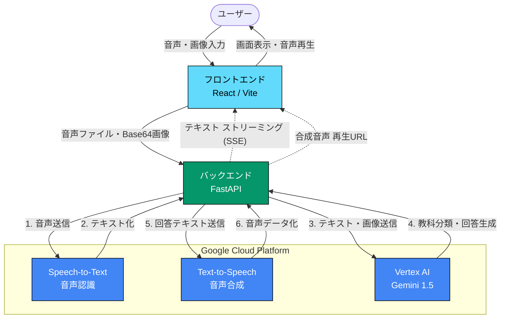

# Tutor-AI アーキテクチャ図

```mermaid
graph TD
    User([ユーザー]) -->|音声・画像入力| FE[フロントエンド<br>React / Vite]
    
    FE -->|音声ファイル・Base64画像| BE[バックエンド<br>FastAPI]
    
    subgraph "Google Cloud Platform"
        STT[Speech-to-Text<br>音声認識]
        TTS[Text-to-Speech<br>音声合成]
        Vertex[Vertex AI<br>Gemini 1.5]
    end
    
    BE -->|1. 音声送信| STT
    STT -->|2. テキスト化| BE
    
    BE -->|3. テキスト・画像送信| Vertex
    Vertex -->|4. 教科分類・回答生成| BE
    
    BE -->|5. 回答テキスト送信| TTS
    TTS -->|6. 音声データ化| BE
    
    BE -.->|"テキスト ストリーミング (SSE)"| FE
    BE -.->|"合成音声 再生URL"| FE
    
    FE -->|画面表示・音声再生| User

    %% スタイリング
    classDef frontend fill:#61DAFB,stroke:#000,stroke-width:1px,color:#000;
    classDef backend fill:#059669,stroke:#000,stroke-width:1px,color:#fff;
    classDef gcp fill:#4285F4,stroke:#000,stroke-width:1px,color:#fff;
    
    class FE frontend;
    class BE backend;
    class STT,TTS,Vertex gcp;
```
